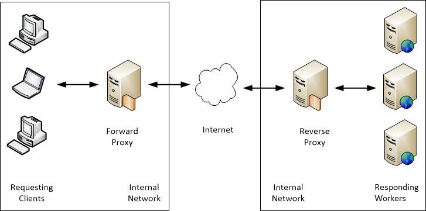
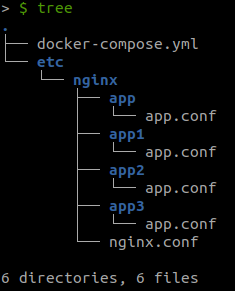

# Nginx Questions

## Links

* [Course: NGINX Web Server Deep Dive](https://linuxacademy.com/cp/modules/view/id/169)
* [Nginx.org/docs](https://nginx.org/en/docs/)
* [Nginx variables](https://nginx.org/en/docs/varindex.html)
* [Throttled configuration](https://www.nginx.com/blog/rate-limiting-nginx/)

## Generate apresentation

```sh
docker run --rm -it -v $PWD:/src node /bin/bash
cd /src
npm install markdown-to-slides --global
markdown-to-slides README.md -d  -o presentation.html
chmod 777 presentation.html
```

## Docker run

```sh
docker run --name nginx \
           --rm -it -p 80:80 \
           -v $PWD/etc/nginx/nginx.conf:/etc/nginx/nginx.conf \
           -v $PWD/etc/nginx/conf.d:/etc/nginx/conf.d  \
           nginx

docker exec -it nginx nginx -t
```

## Questions

* What are locations? Where are they configured?
* How to configure new routes, for example, "/hi-am-a-route" send to XPTO api endpoint.
* How the relationship between the proxypass and the nginx of the apis that receive requests works.
* Relevant information about Proxypass.
* The log files (/ var / log / nginx) of the routes and their structure.
* Throttled configuration

### Agenda

* What is NGINX
* Use Cases
* Proxy vs. Reverse-Proxy
* What are contexts
* What are locations
* Locations where are they configured
* Include in Configuration files
* Many nginx - apis
* The log files (/ var / log / nginx)
* Cache
* Throttled configuration

### What is NGINX

nginx [engine x] is an HTTP and reverse proxy server, a mail proxy server, and a generic TCP/UDP proxy server, originally written by [Igor Sysoev](http://sysoev.ru/en/).

### Use Cases

* High performance web server:
  * Used by over 50% of the top 1,000 sites

* Reverse proxy :
  * SSL/TLS Termination
  * Content caching and compression

* Load Balancer

### Proxy vs. Reverse-Proxy

* Proxy:
  * Sits between our clients and the internet
  * Intermediate layer often used within organizations to monitor web traffic

* Reverse proxy :
  * Sits between internet traffic and our servers
  * Intermediate layer often used to load balance traffic & serve content from a cache



### What are contexts

In config file contexts are where defined directives.
Is a examples called a context: [events](https://nginx.org/en/docs/ngx_core_module.html#events), [http](https://nginx.org/en/docs/http/ngx_http_core_module.html#http), [server](https://nginx.org/en/docs/http/ngx_http_core_module.html#server), and [location](https://nginx.org/en/docs/http/ngx_http_core_module.html#location).

Directives placed outside of any contexts are considered to be in the **main** context. The **events** and **http** directives reside in the **main** context, **server** in **http**, and **location** in **server**.

```nginx
# main

events {
#events
}

http {
#http
    server {
    #server
        location {
        #location
        }
    }
}
```

### What are locations

```nginx
Syntax: location [ = | ~ | ~* | ^~ ] uri { ... }
location @name { ... }
Default: —
Context: server, location
```

Location block specifies the prefix compared with the URI from the request.

* Example:

```nginx
location = / {
    [ configuration A ]
}
location / {
    [ configuration B ]
}
location /documents/ {
    [ configuration C ]
}
location ^~ /images/ {
    [ configuration D ]
}
location ~* \.(gif|jpg|jpeg)$ {
    [ configuration E ]
}
```

### Locations where are they configured

In config file, in context **server** or **location**

```nginx
Syntax: location [ = | ~ | ~* | ^~ ] uri { ... }
location @name { ... }
Default: —
Context: server, location
```

```nginx
    server {
        listen       80;
        server_name  localhost;

        location / {
            default_type application/json;
            return 200 '{"code":"1", "status": "ok"}';
        }
    }
```

```sh
> $ curl -i localhost/
HTTP/1.1 200 OK
Server: nginx/1.17.10
Date: Mon, 27 Apr 2020 17:48:08 GMT
Content-Type: application/json
Content-Length: 28
Connection: keep-alive

{"code":"1", "status": "ok"}
```

### Include in Configuration files

```nginx
Syntax: include file | mask;
Default: —
Context: any
```

Includes another file, or files matching the specified mask, into configuration. Included files should consist of syntactically correct directives and blocks.

```nginx
    include /etc/nginx/conf.d/*.conf;
    include /etc/nginx/sites-enabled/*;
```

### Many nginx - apis



### Many nginx - 1.1 - DEMO

```sh
cd many_nginx/
docker-compose up -d

> $ docker-compose ps
      Name                Command          State         Ports       
---------------------------------------------------------------------
many_nginx_app_a_1   nginx -g daemon off;   Up      0.0.0.0:81->80/tcp
many_nginx_app_b_1   nginx -g daemon off;   Up      0.0.0.0:82->80/tcp
many_nginx_app_c_1   nginx -g daemon off;   Up      0.0.0.0:83->80/tcp
many_nginx_app_1    nginx -g daemon off;   Up      0.0.0.0:80->80/tcp
```

### Many nginx - 1.2 - DEMO

```sh
> $ curl localhost:80
{"app":"M", "status": "ok"}%

> $ curl localhost:81
{"app":"1", "status": "ok"}%

> $ curl localhost:82
{"app":"2", "status": "ok"}%

> $ curl localhost:83
{"app":"3", "status": "ok"}%
```

```sh
app_1   | 172.22.0.1 - - [27/Apr/2020:20:39:49 +0000] "GET / HTTP/1.1" 200 27 "-" "curl/7.64.0" "-"
app_a_1  | 172.22.0.5 - - [27/Apr/2020:20:39:52 +0000] "GET /1 HTTP/1.0" 200 27 "-" "curl/7.64.0" "-"
app_1   | 172.22.0.1 - - [27/Apr/2020:20:39:52 +0000] "GET /1 HTTP/1.1" 200 27 "-" "curl/7.64.0" "-"
```

### Many nginx - 1.3 - DEMO

```nginx
# app master a file app_a.conf
upstream up_app_a {
    server app_a:80 fail_timeout=30s max_fails=0;
    least_conn;
    keepalive 16;
}

server {
    server_name app_a.example.com;

    location / {
        proxy_pass http://up_app_a;
        proxy_redirect off;
    }
}
```

```sh
> $ curl  --resolve app_a.example.com:80:127.0.0.1 http://app_a.example.com
{"app":"1", "status": "ok"}%  
```

```sh
app_a_1  | 172.22.0.3 - - [27/Apr/2020:20:55:54 +0000] "GET / HTTP/1.0" 200 27 "-" "curl/7.64.0" "-"
app_1    | 172.22.0.1 - - [27/Apr/2020:20:55:54 +0000] "GET / HTTP/1.1" 200 27 "-" "curl/7.64.0" "-"
```

### The log files (/ var / log / nginx)

The structure de log is using log_format defined in nginx.conf.

```nginx
# nginx.conf
    log_format  main  '$remote_addr - $remote_user [$time_local] "$request" '
                      '$status $body_bytes_sent "$http_referer" '
                      '"$http_user_agent" "$http_x_forwarded_for"';

    access_log  /var/log/nginx/access.log  main;

    map $status $log_condition_fail {
        ~^[23] 0;
        default 1;
    }

    map $status $log_condition_ok {
        ~^[45] 0;
        default 1;
    }
```

```nginx
# app
server {
    access_log  /var/log/nginx/access.log debug if=$log_condition_fail;
    access_log /var/log/nginx/access.log  main  if=$log_condition_ok;
}
```

### The log files (/ var / log / nginx) - DEMO

```sh
> $ curl  --resolve app_b.example.com:80:127.0.0.1 http://app_b.example.com
{"app":"2", "status": "ok"}%

> $ curl  --resolve app_b.example.com:80:127.0.0.1 http://app_b.example.com/500
{"app":"2", "status": "500"}%

> $ curl  --resolve app_b.example.com:80:127.0.0.1 http://app_b.example.com
{"app":"2", "status": "ok"}%

> $ curl  --resolve app_b.example.com:80:127.0.0.1 http://app_b.example.com/400
{"app":"2", "status": "400"}%
```

```sh
app_1    | 172.22.0.1 - - [27/Apr/2020:21:16:46 +0000] "GET / HTTP/1.1" 200 27 "-" "curl/7.64.0" "-"
app_b_1  | 172.22.0.4 - - [27/Apr/2020:21:16:46 +0000] "GET / HTTP/1.0" 200 27 "-" "curl/7.64.0" "-"
app_b_1  | 172.22.0.4 - - [27/Apr/2020:21:16:52 +0000] "GET /500 HTTP/1.0" 500 28 "-" "curl/7.64.0" "-"
app_1    | 172.22.0.1 - 6081d4edc323553f5088556308553907 - - [27/Apr/2020:21:16:52 +0000] "GET /500 HTTP/1.1" 500 28 "-" "curl/7.64.0" "-"
app_b_1  | 172.22.0.4 - - [27/Apr/2020:21:16:58 +0000] "GET / HTTP/1.0" 200 27 "-" "curl/7.64.0" "-"
app_1    | 172.22.0.1 - - [27/Apr/2020:21:16:58 +0000] "GET / HTTP/1.1" 200 27 "-" "curl/7.64.0" "-"
app_b_1  | 172.22.0.4 - - [27/Apr/2020:21:17:03 +0000] "GET /400 HTTP/1.0" 400 28 "-" "curl/7.64.0" "-"
app_1    | 172.22.0.1 - 5ecfa28281bd5a883a2f847349b53ca5 - - [27/Apr/2020:21:17:03 +0000] "GET /400 HTTP/1.1" 400 28 "-" "curl/7.64.0" "-"
```

### Cache

```nginx
proxy_cache_path /dev/shm/app_c_cache levels=1:2 use_temp_path=on keys_zone=nearby_places_cache:1m inactive=1m max_size=1m;

log_format  log_cache  '$remote_addr - cache_status:"$upstream_cache_status" - $remote_user [$time_local] "$request" '
                    '$status $body_bytes_sent "$http_referer" '
                    '"$http_user_agent" "$http_x_forwarded_for"';

server {
    server_name app_c.example.com;

    access_log  /var/log/nginx/access.log  log_cache;

    location / {
        proxy_cache_key $scheme$host$request_uri;
        proxy_cache nearby_places_cache;
        proxy_cache_valid 200 301 302 304 5m;
        proxy_pass http://up_app_c;
        proxy_redirect off;
    }
}
```

### Cache - DEMO

```sh
> $ curl  --resolve app_c.example.com:80:127.0.0.1 http://app_c.example.com/
{"app":"3", "status": "ok"}%

> $ curl  --resolve app_c.example.com:80:127.0.0.1 http://app_c.example.com/
{"app":"3", "status": "ok"}%
```

```sh
app_c_1  | 172.22.0.2 - - [27/Apr/2020:23:52:15 +0000] "GET / HTTP/1.0" 200 27 "-" "curl/7.64.0" "-"
app_1    | 172.22.0.1 - cache_status:"MISS" - - [27/Apr/2020:23:52:15 +0000] "GET / HTTP/1.1" 200 27 "-" "curl/7.64.0" "-"
app_1    | 172.22.0.1 - cache_status:"HIT" - - [27/Apr/2020:23:52:25 +0000] "GET / HTTP/1.1" 200 27 "-" "curl/7.64.0" "-"
```

### Throttled configuration

```nginx
limit_req_zone $binary_remote_addr zone=mylimit:10m rate=10r/s;

server {
    location /login/ {
        limit_req zone=mylimit;
        proxy_pass http://my_upstream;
    }
}
```

```nginx
location /login/ {
    limit_req zone=mylimit burst=20;
    proxy_pass http://my_upstream;
}
```

The **burst** parameter defines how many requests a client can make in excess of the rate specified by the zone (with our sample mylimit zone, the rate limit is 10 requests per second, or 1 every 100 milliseconds). 

### Throttled configuration - DEMO

```sh
curl  --resolve app_d.example.com:80:127.0.0.curl: (52) Empty reply from server

curl  -i --resolve app_d.example.com:80:127.0.0.1 http://app_d.example.com/
HTTP/1.1 200 OK
Server: nginx/1.17.10
Date: Tue, 28 Apr 2020 00:09:54 GMT
Content-Type: application/json
Content-Length: 27
Connection: keep-alive
```

```sh
app_d_1  | 172.23.0.4 - - [28/Apr/2020:00:09:55 +0000] "GET / HTTP/1.0" 200 27 "-" "curl/7.64.0" "-"
app_1    | 2020/04/28 00:09:56 [warn] 6#6: *495 limiting requests, excess: 0.220 by zone "app_d_limit", client: 172.23.0.1, server: app_d.example.com, request: "GET / HTTP/1.1", host: "app_d.example.com"
app_1    | 172.23.0.1 - - [28/Apr/2020:00:09:56 +0000] "GET / HTTP/1.1" 444 0 "-" "curl/7.64.0" "-"
```
